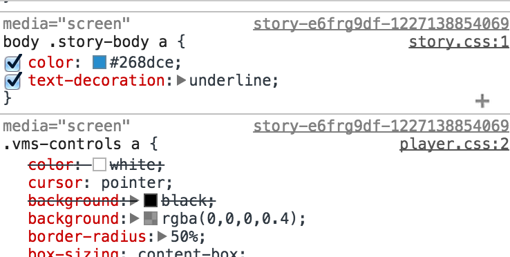

# Shadow (Con)DOM

**tl;dr;**
	
Shadow Dom is the CSS condom, it prevents unwanted leakage.

# The problem

CSS suffers from leakage freakage!

[demo css styles](./demo.html)

## Fix 1: CSS *anti-patterns*

* Increase CSS specificity
* Use `!important`

*ULTIMATLY*

CSS leakage *= unwanted impregnanation*.

	body.theme div#parent #child a{
		color: #DAD;
		position: sticky !important;
	}

> As we all (should) probably know by now, specificity is is one of CSS’ most troublesome features, and is an area that soon becomes hard to manage on projects of any reasonable size. Specificity is a trait best avoided, which is why we don’t use IDs in CSS, and we don’t nest selectors unless absolutely necessary.

- [Harry Roberts](http://csswizardry.com/2014/10/the-specificity-graph/)

## Fix 2: iframe it

	<iframe src="widget.html">
	    #document
	</iframe>

* Black box, no themes, nothing
* Unable to expand with content
* Performance poor

... a new hope!

*[drum role please]*

# Shadow DOM
Stands for: Shit Hot and Awesomeness, Dude! Omg! Wow!

	If HTML elements were Xmas presents, 
	the Shadow Dom would be the wrapping.

- Andrew Dodson (@SydCSS, Dec 4th 2014)

## What is it?

	<video>
	  #shadow-root
	     <tree>

[shadowy elements](./native-shadow.html)

## Browser

* Chrome    √
* FireFox   flag
* IE        ?
* Safari    n/a

## Create Shadow in JS

Create a shadow-root and "distribute" the existing children.

	var root = el.createShadowRoot();
	root.innerHTML = `<content></content>`;

## importNode

Phyisically move the controls element to the shadow-root.

	var controls = el.querySelector('.controls');
	controls = document.importNode( controls, true);
	root.appendChild( controls );

## Style the Shadow DOM nodes

Import widget styles.

	root.innerHTML += '';

Note: Use BEM, and it will mostly work

	.parent {...}
	.parent__child {...}
	.parent--mistake__child {...}

### Trigger styles from :host

For host node conditions

	:host(.ready.player) .controls{
		display:block;
	}

For nodes ancestor conditions

	:host-context(body.touch){
		font-size: 1.2em;
	}

## Style distributed Nodes

	::content h2{
		text-decoration:underline;
	}

## Style based on context

	:host-context(body.touch) button{
		font-size:1.3em;
	}

## Shadow's CSS and its Backwards Snapability

These do not sit well together in 2014 browsers

	:host, .player{
		background:black;
	}

[demo entwined styles](demo2.html) will break in all but Chrome.

Hack: Change it via javascript!

	styles.replace( /.player\b/g, ':host')

[demo make styles compatible](demo3.html)

## Theming
Unlike the black box which is IFrames this will let light in.

* `.player::shadow`  - reference the shadow psuedo element
* `body /deep/ .theme-background-color` - optionally target shadow content and elements nested nodes (see themes)[themes.css]

# Heads up, Custom Elements

If you dont want to get caught by styles targeting native elements, create your own.

<custom-tagname></custom-tagname>

	custom-tagname{
		color:red;
		display:block;
	}

Even register handlers to style them before they are drawn to the page.

	registerHandler('custom-tagname', { proto : ... })

[custom elements](./custom-tag.html)

# Summary

Shadow condom could save you about 18 years of bugfixing.

# References

Fantastic articles ...

* [Shadow DOM 101](www.html5rocks.com/en/tutorials/webcomponents/shadowdom/)
* [Shadow DOM 201](www.html5rocks.com/en/tutorials/webcomponents/shadowdom-201)
* [Shadow DOM 301](www.html5rocks.com/en/tutorials/webcomponents/shadowdom-301)
* [WebComponentsOrg](http://webcomponents.org/articles/)

